# Reactory KYC Module Specification

## 1. Overview

The Reactory KYC (Know Your Customer) module is a comprehensive identity verification and compliance system designed to extend the Reactory framework with robust customer verification capabilities. The module supports both manual verification workflows and automated verification through third-party providers, ensuring flexible implementation for various regulatory requirements.

### 1.1 Purpose

The KYC module enables organizations to:
- Verify customer identities through multiple channels
- Comply with regulatory requirements (AML, CFT, etc.)
- Maintain audit trails for compliance reporting
- Integrate with third-party verification services
- Manage verification workflows efficiently
- Track and report verification statuses

### 1.2 Key Features

- **Multi-Provider Support**: Integrate with multiple KYC service providers (Trulio, Onfido, etc.)
- **Manual Verification**: Support for human-in-the-loop verification processes
- **Automated Verification**: Streamlined automated verification workflows
- **Queue-Based Processing**: Scalable, asynchronous verification processing
- **Workflow Engine Integration**: Leverage Reactory's workflow engine for complex verification flows
- **Audit Trail**: Comprehensive logging and audit capabilities
- **Multi-Tenant Support**: Organization-specific verification configurations
- **Document Management**: Secure storage and management of verification documents
- **Risk Scoring**: Configurable risk assessment and scoring
- **Compliance Reporting**: Generate compliance reports for regulatory bodies

## 2. Architecture

### 2.1 High-Level Architecture

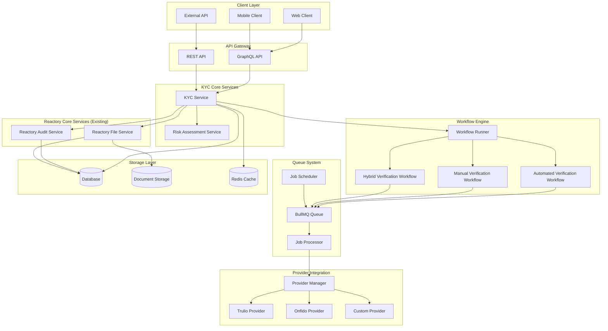

### 2.2 Module Structure

```
reactory-kyc/
├── index.ts                    # Module definition and exports
├── readme.md                   # Module overview
├── specification.md            # This document
├── package.json               # Module dependencies
│
├── cli/                       # CLI commands
│   ├── index.ts
│   ├── verify-user.ts         # Manual verification command
│   ├── check-status.ts        # Check verification status
│   └── generate-report.ts     # Generate compliance reports
│
├── services/                  # Core business logic
│   ├── index.ts
│   ├── KYCService.ts          # Main KYC orchestration service
│   ├── KYCDocumentService.ts  # KYC-specific document wrapper (uses core.ReactoryFileService)
│   ├── RiskAssessmentService.ts # Risk scoring and assessment
│   ├── KYCAuditService.ts     # KYC-specific audit wrapper (uses core.ReactoryAuditService)
│   ├── ProviderService.ts     # Third-party provider integration
│   └── ReportingService.ts    # Compliance reporting
│
├── providers/                 # Third-party provider integrations
│   ├── index.ts
│   ├── BaseProvider.ts        # Abstract base provider class
│   ├── TrulioProvider.ts      # Trulio integration
│   ├── OnfidoProvider.ts      # Onfido integration
│   └── types.ts               # Provider-specific types
│
├── workflows/                 # Workflow definitions
│   ├── index.ts
│   ├── ManualVerificationWorkflow.ts
│   ├── AutomatedVerificationWorkflow.ts
│   ├── HybridVerificationWorkflow.ts
│   └── DocumentVerificationWorkflow.ts
│
├── queues/                    # Queue job definitions
│   ├── index.ts
│   ├── VerificationQueue.ts   # Verification job queue
│   ├── DocumentProcessingQueue.ts # Document processing queue
│   └── NotificationQueue.ts   # Notification job queue
│
├── models/                    # Data models
│   ├── index.ts
│   ├── KYCVerification.ts     # Main verification model
│   ├── KYCDocument.ts         # Document model
│   ├── KYCRiskScore.ts        # Risk score model
│   ├── KYCAuditLog.ts         # Audit log model
│   └── KYCProvider.ts         # Provider configuration model
│
├── graphql/                   # GraphQL definitions
│   ├── index.ts
│   ├── schema/
│   │   ├── kyc.graphql        # KYC type definitions
│   │   ├── verification.graphql
│   │   └── document.graphql
│   └── resolvers/
│       ├── index.ts
│       ├── KYCResolver.ts
│       └── DocumentResolver.ts
│
├── forms/                     # Reactory form definitions
│   ├── index.ts
│   ├── UserVerificationForm.ts
│   ├── DocumentUploadForm.ts
│   └── ManualReviewForm.ts
│
├── routes/                    # REST API routes
│   ├── index.ts
│   ├── kyc.ts                 # KYC endpoints
│   ├── webhooks.ts            # Provider webhooks
│   └── documents.ts           # Document endpoints
│
├── middleware/                # Express middleware
│   ├── index.ts
│   ├── verification-check.ts  # Verification status check
│   └── compliance-logger.ts   # Compliance logging
│
├── types/                     # TypeScript type definitions
│   ├── index.ts
│   ├── kyc.types.ts
│   ├── provider.types.ts
│   └── workflow.types.ts
│
├── utils/                     # Utility functions
│   ├── index.ts
│   ├── validators.ts          # Input validation
│   ├── encryption.ts          # Document encryption
│   └── risk-calculator.ts     # Risk score calculation
│
├── data/                      # Static data and configurations
│   ├── risk-rules.json        # Risk assessment rules
│   ├── country-requirements.json # Country-specific KYC requirements
│   └── document-types.json    # Supported document types
│
└── i18n/                      # Internationalization
    ├── en.json
    ├── es.json
    └── fr.json
```

## 3. Core Components

### 3.1 KYC Service

The main orchestration service that coordinates all KYC operations.

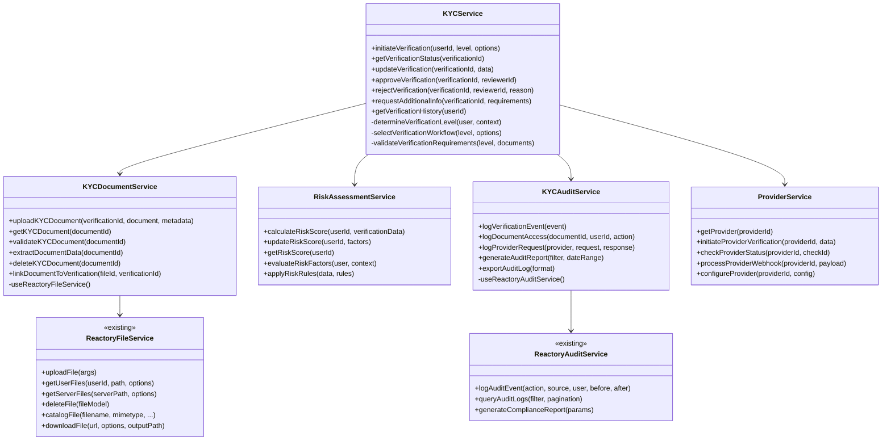

### 3.2 Provider Integration

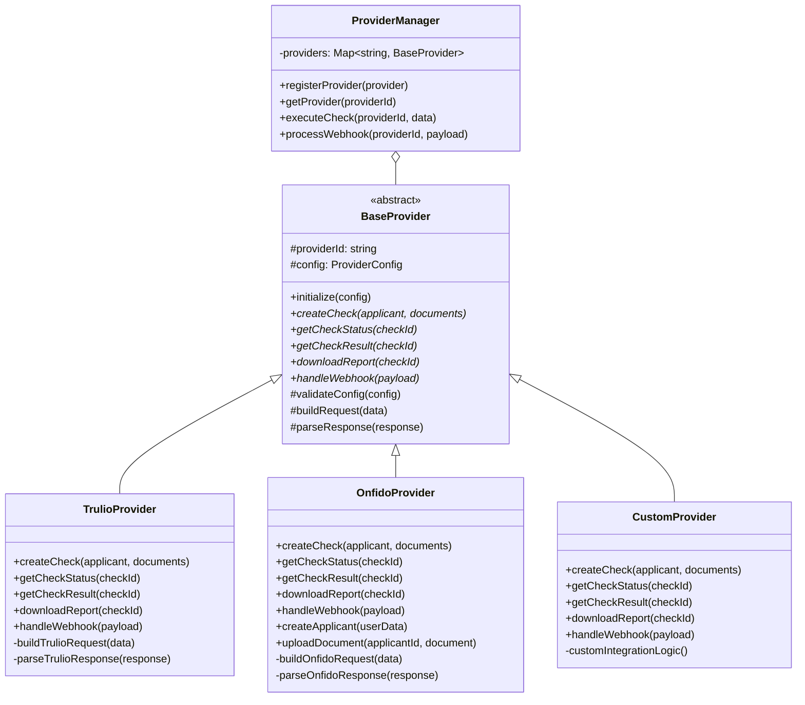

## 4. Verification Workflows

### 4.1 Manual Verification Workflow

Manual verification workflow where human reviewers assess submitted documents and information.

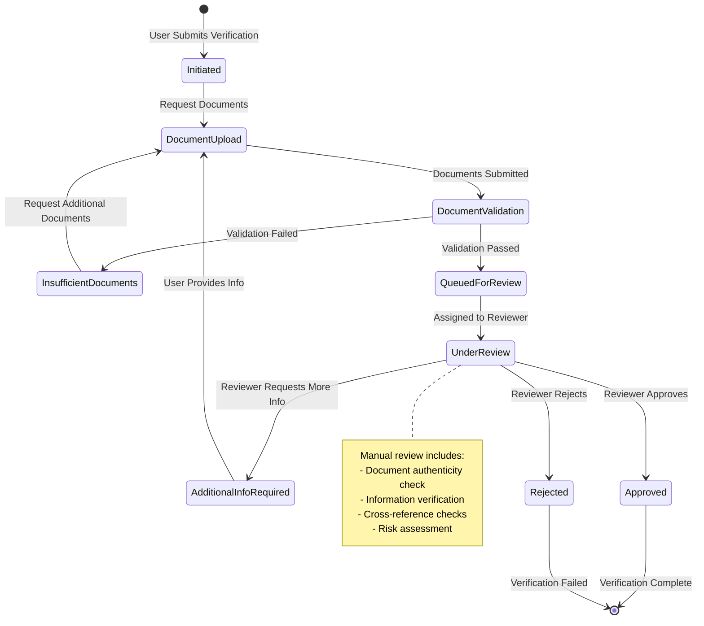

### 4.2 Automated Verification Workflow

Fully automated verification using third-party providers.

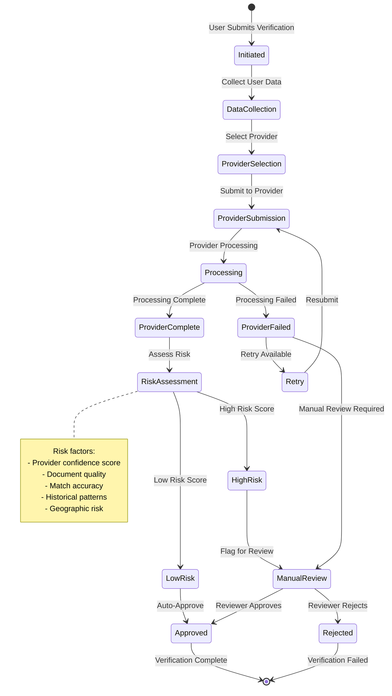

### 4.3 Hybrid Verification Workflow

Combination of automated and manual verification with intelligent routing.

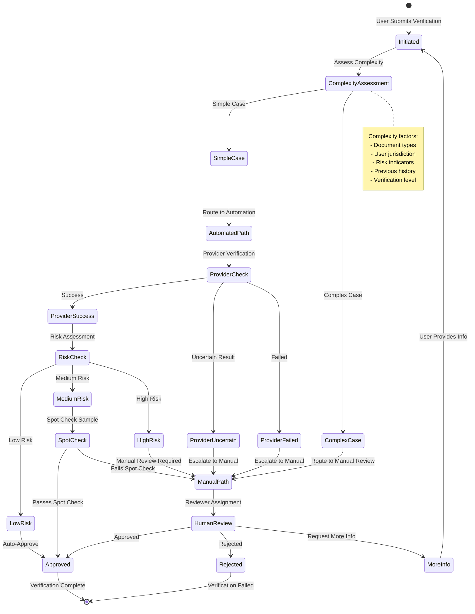

## 5. Queue-Based Processing

### 5.1 Queue Architecture

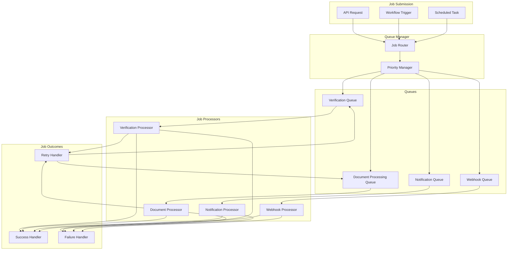

### 5.2 Queue Job Types

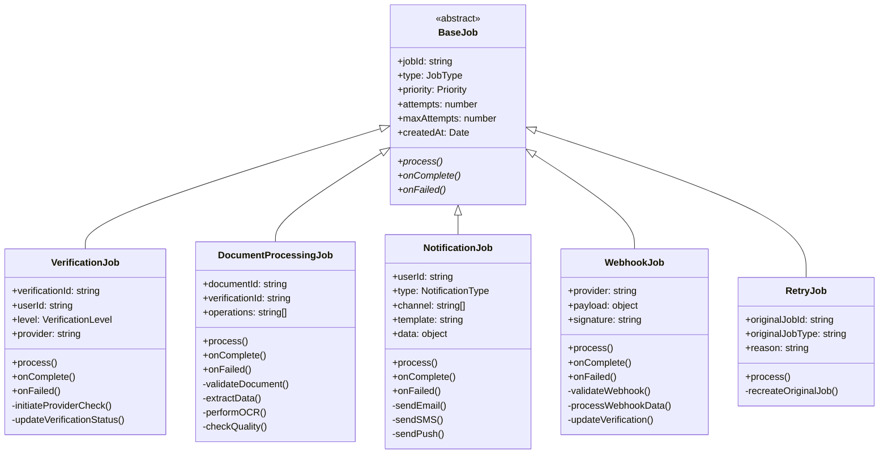

## 6. Data Models

### 6.1 Core Data Model

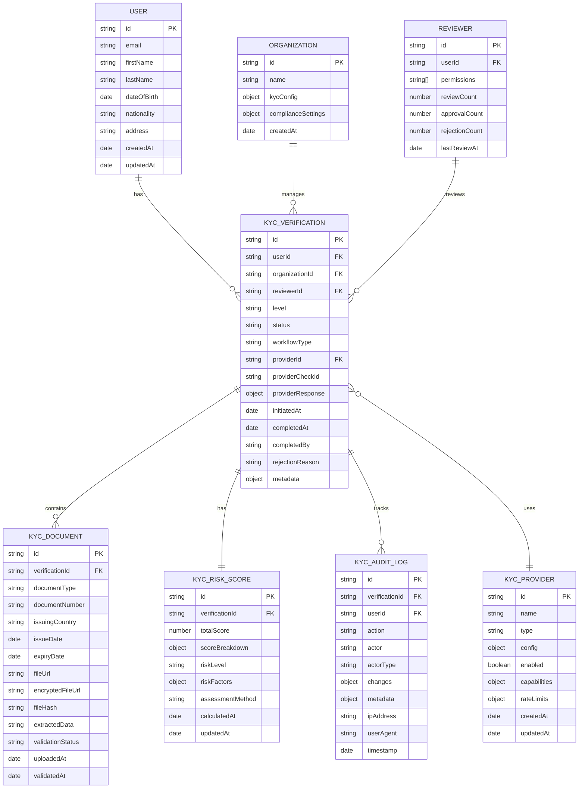

### 6.2 Verification Status States

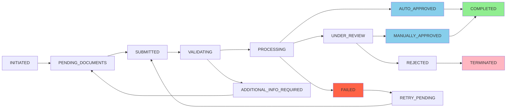

## 7. API Specifications

### 7.1 GraphQL Schema (Key Types)

```graphql
# KYC Verification Level
enum VerificationLevel {
  BASIC
  INTERMEDIATE
  ADVANCED
  ENHANCED
}

# Verification Status
enum VerificationStatus {
  INITIATED
  PENDING_DOCUMENTS
  SUBMITTED
  VALIDATING
  PROCESSING
  UNDER_REVIEW
  AUTO_APPROVED
  MANUALLY_APPROVED
  REJECTED
  FAILED
  ADDITIONAL_INFO_REQUIRED
  RETRY_PENDING
  COMPLETED
  TERMINATED
}

# Document Types
enum DocumentType {
  PASSPORT
  NATIONAL_ID
  DRIVERS_LICENSE
  PROOF_OF_ADDRESS
  BANK_STATEMENT
  UTILITY_BILL
  SELFIE
  LIVENESS_VIDEO
}

# Risk Level
enum RiskLevel {
  LOW
  MEDIUM
  HIGH
  CRITICAL
}

# Main KYC Verification Type
type KYCVerification {
  id: ID!
  user: User!
  organization: Organization!
  level: VerificationLevel!
  status: VerificationStatus!
  workflowType: String!
  provider: KYCProvider
  providerCheckId: String
  documents: [KYCDocument!]!
  riskScore: KYCRiskScore
  auditLogs: [KYCAuditLog!]!
  reviewer: Reviewer
  initiatedAt: DateTime!
  completedAt: DateTime
  rejectionReason: String
  metadata: JSON
}

# Document Type
type KYCDocument {
  id: ID!
  verification: KYCVerification!
  documentType: DocumentType!
  documentNumber: String
  issuingCountry: String
  issueDate: Date
  expiryDate: Date
  fileUrl: String
  validationStatus: String!
  extractedData: JSON
  uploadedAt: DateTime!
  validatedAt: DateTime
}

# Risk Score Type
type KYCRiskScore {
  id: ID!
  verification: KYCVerification!
  totalScore: Float!
  scoreBreakdown: JSON!
  riskLevel: RiskLevel!
  riskFactors: [RiskFactor!]!
  assessmentMethod: String!
  calculatedAt: DateTime!
}

# Risk Factor Type
type RiskFactor {
  factor: String!
  score: Float!
  weight: Float!
  description: String
}

# Provider Type
type KYCProvider {
  id: ID!
  name: String!
  type: String!
  enabled: Boolean!
  capabilities: [String!]!
}

# Audit Log Type
type KYCAuditLog {
  id: ID!
  verification: KYCVerification!
  action: String!
  actor: String!
  actorType: String!
  changes: JSON
  timestamp: DateTime!
  ipAddress: String
}

# Queries
type Query {
  # Get verification by ID
  kycVerification(id: ID!): KYCVerification
  
  # Get user's verification history
  userVerifications(userId: ID!, status: VerificationStatus): [KYCVerification!]!
  
  # Get verifications for review (admin/reviewer)
  verificationsForReview(
    level: VerificationLevel
    status: VerificationStatus
    limit: Int
    offset: Int
  ): KYCVerificationConnection!
  
  # Get verification statistics
  verificationStats(
    organizationId: ID
    startDate: DateTime
    endDate: DateTime
  ): KYCStatistics!
  
  # Get document by ID
  kycDocument(id: ID!): KYCDocument
  
  # Get available providers
  kycProviders(enabled: Boolean): [KYCProvider!]!
}

# Mutations
type Mutation {
  # Initiate verification
  initiateKYCVerification(
    userId: ID!
    level: VerificationLevel!
    workflowType: String
    providerId: ID
  ): KYCVerification!
  
  # Upload document
  uploadKYCDocument(
    verificationId: ID!
    documentType: DocumentType!
    file: Upload!
    metadata: JSON
  ): KYCDocument!
  
  # Submit verification for processing
  submitKYCVerification(verificationId: ID!): KYCVerification!
  
  # Manual review actions
  approveKYCVerification(
    verificationId: ID!
    reviewerNotes: String
  ): KYCVerification!
  
  rejectKYCVerification(
    verificationId: ID!
    reason: String!
    reviewerNotes: String
  ): KYCVerification!
  
  requestAdditionalInfo(
    verificationId: ID!
    requirements: [String!]!
    message: String
  ): KYCVerification!
  
  # Provider operations
  retryProviderCheck(verificationId: ID!): KYCVerification!
}

# Subscriptions
type Subscription {
  # Subscribe to verification status changes
  verificationStatusChanged(verificationId: ID!): KYCVerification!
  
  # Subscribe to new verifications for review
  newVerificationForReview(level: VerificationLevel): KYCVerification!
}
```

### 7.2 REST API Endpoints

```
# Verification Endpoints
POST   /api/kyc/verification/initiate          # Initiate new verification
GET    /api/kyc/verification/:id                # Get verification details
PUT    /api/kyc/verification/:id/submit         # Submit verification
POST   /api/kyc/verification/:id/approve        # Approve verification
POST   /api/kyc/verification/:id/reject         # Reject verification
POST   /api/kyc/verification/:id/request-info   # Request additional info
GET    /api/kyc/verification/user/:userId       # Get user's verifications
GET    /api/kyc/verification/review             # Get verifications for review

# Document Endpoints
POST   /api/kyc/document/upload                 # Upload document
GET    /api/kyc/document/:id                    # Get document
DELETE /api/kyc/document/:id                    # Delete document
POST   /api/kyc/document/:id/validate           # Validate document
GET    /api/kyc/document/:id/download           # Download document

# Provider Endpoints
GET    /api/kyc/provider                        # List providers
GET    /api/kyc/provider/:id                    # Get provider details
POST   /api/kyc/provider/:id/check              # Initiate provider check
GET    /api/kyc/provider/:id/status/:checkId    # Check status

# Webhook Endpoints
POST   /api/kyc/webhook/trulio                  # Trulio webhook
POST   /api/kyc/webhook/onfido                  # Onfido webhook
POST   /api/kyc/webhook/:provider               # Generic provider webhook

# Reporting Endpoints
GET    /api/kyc/report/statistics               # Get verification statistics
GET    /api/kyc/report/audit                    # Get audit report
GET    /api/kyc/report/compliance               # Get compliance report
POST   /api/kyc/report/export                   # Export report
```

## 8. Workflow Execution Flows

### 8.1 Complete Verification Flow

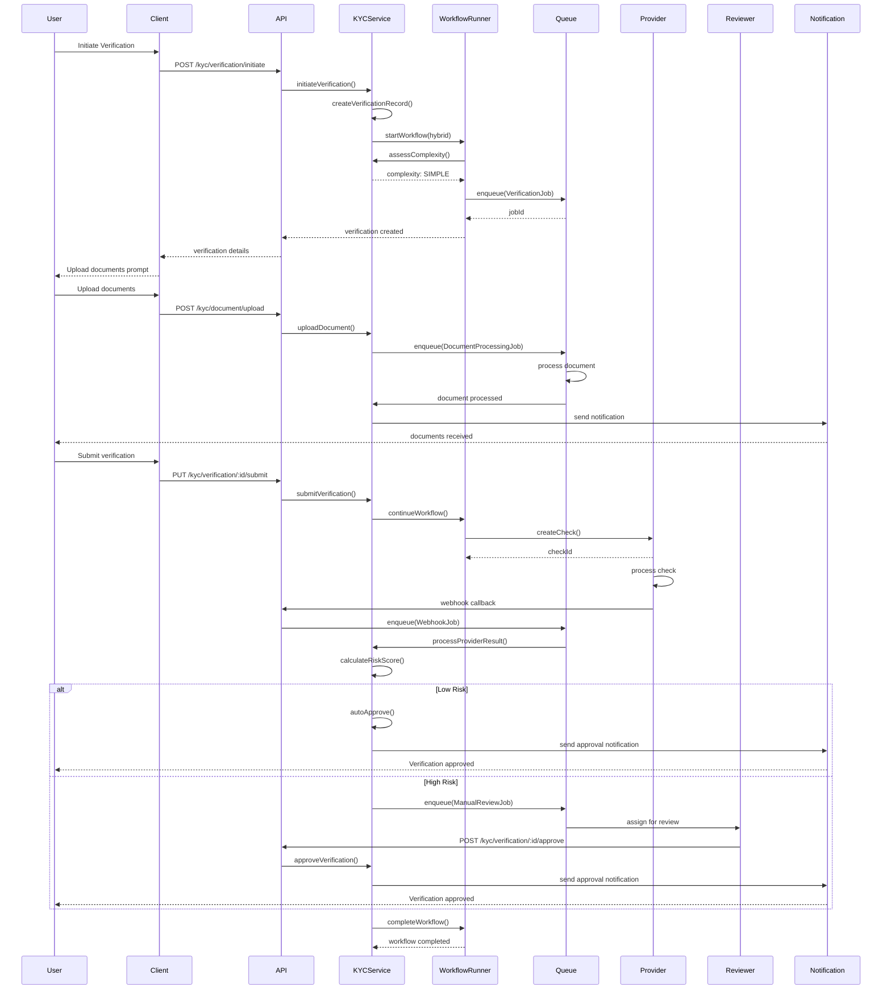

### 8.2 Manual Review Process

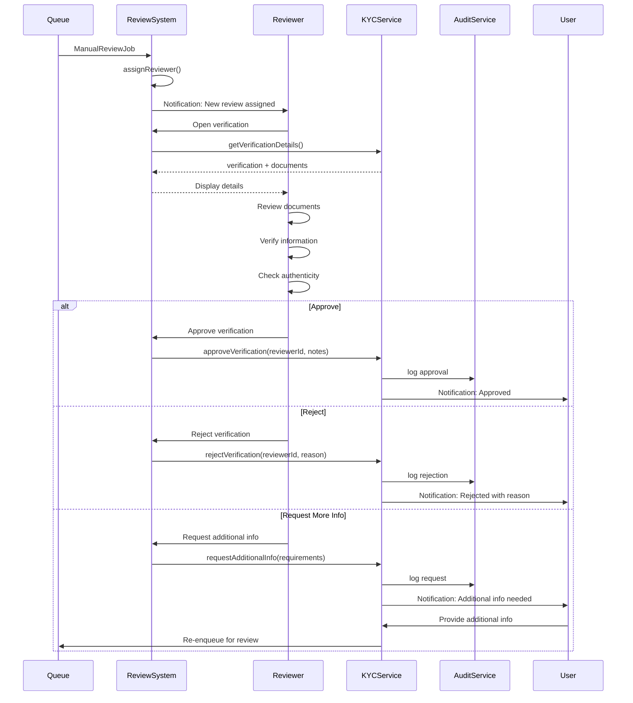

## 9. Security & Compliance

### 9.1 Security Measures

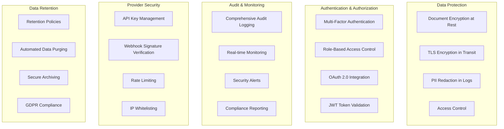

### 9.2 Compliance Framework

- **GDPR**: Right to access, right to erasure, data portability
- **AML (Anti-Money Laundering)**: Transaction monitoring, suspicious activity reporting
- **KYC Regulations**: Identity verification standards, customer due diligence
- **PCI DSS**: (if handling payment information)
- **SOC 2**: Security controls and audit trails

## 10. Performance & Scalability

### 10.1 Performance Targets

- **Verification Initiation**: < 500ms response time
- **Document Upload**: < 2s for documents up to 10MB
- **Provider API Calls**: < 5s timeout with retry logic
- **Manual Review Assignment**: < 1s
- **Queue Processing**: Min 100 jobs/second throughput
- **Report Generation**: < 10s for standard reports

### 10.2 Scalability Strategy

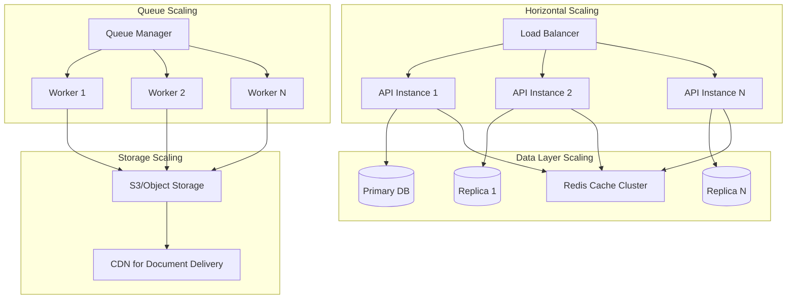

## 11. Configuration

### 11.1 Module Configuration

```typescript
interface KYCModuleConfig {
  providers: {
    trulio: {
      enabled: boolean;
      apiKey: string;
      apiUrl: string;
      webhookSecret: string;
      timeout: number;
    };
    onfido: {
      enabled: boolean;
      apiKey: string;
      apiUrl: string;
      webhookSecret: string;
      timeout: number;
    };
  };
  workflows: {
    default: 'manual' | 'automated' | 'hybrid';
    complexityThresholds: {
      simple: number;
      complex: number;
    };
  };
  verification: {
    levels: {
      basic: VerificationLevelConfig;
      intermediate: VerificationLevelConfig;
      advanced: VerificationLevelConfig;
      enhanced: VerificationLevelConfig;
    };
    documentRetention: {
      days: number;
      archiveAfterDays: number;
    };
  };
  riskAssessment: {
    enabled: boolean;
    autoApproveThreshold: number;
    manualReviewThreshold: number;
    rejectThreshold: number;
  };
  queues: {
    verification: QueueConfig;
    documentProcessing: QueueConfig;
    notification: QueueConfig;
  };
  notifications: {
    email: boolean;
    sms: boolean;
    push: boolean;
  };
  compliance: {
    auditLogRetention: number;
    reportingSchedule: string;
    dataProtection: {
      encryptDocuments: boolean;
      encryptionAlgorithm: string;
    };
  };
}
```

## 12. Testing Strategy

### 12.1 Test Coverage

- **Unit Tests**: All services, utilities, and providers (>85% coverage)
- **Integration Tests**: Workflow execution, queue processing, API endpoints
- **E2E Tests**: Complete verification flows from initiation to completion
- **Provider Tests**: Mock provider integrations and webhook handling
- **Security Tests**: Vulnerability scanning, penetration testing
- **Load Tests**: Performance under high load, queue throughput
- **Compliance Tests**: GDPR, AML, and regulatory requirement validation

### 12.2 Test Scenarios

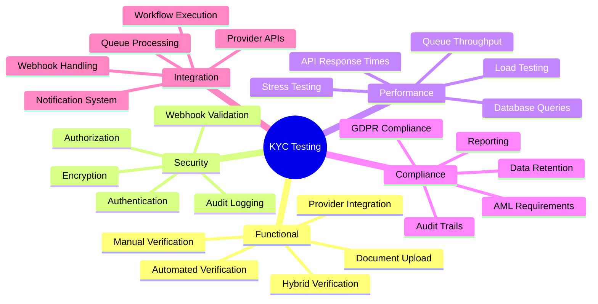

## 13. Monitoring & Observability

### 13.1 Metrics

- **Verification Metrics**
  - Total verifications initiated
  - Verification completion rate
  - Average time to complete
  - Approval/rejection rates
  - Provider success rates

- **System Metrics**
  - API response times
  - Queue processing rates
  - Queue depths
  - Worker utilization
  - Database query performance

- **Business Metrics**
  - Cost per verification
  - Provider costs
  - Manual review workload
  - Compliance report generation

### 13.2 Logging

- **Structured Logging**: JSON format for all log entries
- **Log Levels**: DEBUG, INFO, WARN, ERROR, CRITICAL
- **Log Aggregation**: Centralized logging with ELK/Splunk
- **Audit Logs**: Separate audit log stream for compliance

## 14. Deployment

### 14.1 Environment Configuration

- **Development**: Local development with mock providers
- **Staging**: Full integration with sandbox provider APIs
- **Production**: Production provider APIs, full monitoring

### 14.2 Deployment Strategy

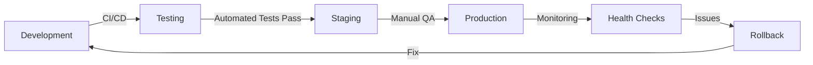

## 15. Future Enhancements

### 15.1 Roadmap

**Phase 1** (Current Specification)
- Manual verification workflows
- Automated verification with Trulio and Onfido
- Hybrid verification workflows
- Document management
- Risk assessment
- Audit logging

**Phase 2**
- Additional provider integrations
- Machine learning for risk assessment
- Biometric verification (facial recognition, fingerprint)
- Video verification (liveness checks)
- Blockchain-based document verification
- Advanced fraud detection

**Phase 3**
- AI-powered document forgery detection
- Continuous monitoring and re-verification
- Real-time compliance dashboards
- Multi-jurisdiction compliance automation
- Customer risk scoring evolution
- Predictive analytics for verification outcomes

**Phase 4**
- Decentralized identity verification
- Self-sovereign identity integration
- Cross-border verification orchestration
- Regulatory technology (RegTech) automation
- Zero-knowledge proof verification

## 16. Dependencies

### 16.1 Internal Reactory Dependencies

- `reactory-core`: Core type definitions and shared components
  - `core.ReactoryFileService@1.0.0`: File upload, storage, and management
  - `core.ReactoryAuditService@1.0.0`: Audit logging and compliance tracking (to be created)
  - `Audit` model: TypeORM entity for audit records
- `reactory-queue`: Queue management and job processing (BullMQ integration)
- `reactory-workflow`: Workflow orchestration engine (WorkflowRunner)

### 16.2 Client-Side Integration (Existing Components)

The KYC module will leverage existing client-side components for document management:

- **UserHomeFolder Component**: React component (`UserHomeFolder.tsx`) that provides:
  - File browser with folder navigation
  - Document upload with drag-and-drop
  - File selection and multi-selection
  - Integration with `core.ReactoryFileService` via GraphQL
  - Custom hooks: `useUserHomeFiles`, `useFileOperations`, `useFolderState`
  
- **File Upload Pattern**: The existing implementation demonstrates:
  ```typescript
  // Upload using GraphQL mutation
  const uploadResult = await reactory.graphqlMutation(
    UPLOAD_FILE_MUTATION,
    { file, uploadContext, virtualPath }
  );
  ```

The KYC module will extend this pattern with:
- KYC-specific document types and validation
- Verification context linking
- Enhanced metadata for compliance tracking

### 16.3 External Dependencies

- **BullMQ**: Queue management
- **Redis**: Caching and queue backend
- **MongoDB/PostgreSQL**: Primary database
- **AWS S3/Azure Blob**: Document storage
- **Sharp**: Image processing
- **PDF-Parse**: PDF document parsing
- **Tesseract.js**: OCR for document data extraction
- **Node-jose**: JWT and encryption
- **Axios**: HTTP client for provider APIs
- **Joi**: Input validation
- **Winston**: Logging framework

## 17. Success Criteria

The KYC module will be considered successful when:

1. **Functional Requirements Met**
   - Manual verification workflows operational
   - Automated verification with at least 2 providers
   - Hybrid workflows with intelligent routing
   - Document upload and validation working
   - Risk assessment functioning

2. **Performance Requirements Met**
   - API response times < 500ms
   - Queue throughput > 100 jobs/second
   - 99.9% uptime

3. **Security Requirements Met**
   - All documents encrypted at rest
   - All API communications over TLS
   - Audit logging for all actions
   - GDPR compliance verified

4. **Business Requirements Met**
   - Reduces manual review workload by 60%
   - Verification completion time reduced by 50%
   - Provider integration working with 95%+ success rate
   - Compliance reports generated successfully

## 18. Conclusion

The Reactory KYC module provides a comprehensive, scalable, and compliant solution for customer identity verification. By leveraging the Reactory framework's workflow engine, queue system, and modular architecture, the module offers flexibility in verification approaches while maintaining security, auditability, and performance.

The specification emphasizes:
- **Flexibility**: Support for manual, automated, and hybrid workflows
- **Scalability**: Queue-based processing and horizontal scaling
- **Security**: Encryption, audit logging, and access control
- **Compliance**: Built-in support for GDPR, AML, and other regulations
- **Extensibility**: Plugin-based provider integration
- **Observability**: Comprehensive monitoring and reporting

This foundation enables organizations to implement robust KYC processes that adapt to their specific requirements and scale with their growth.
